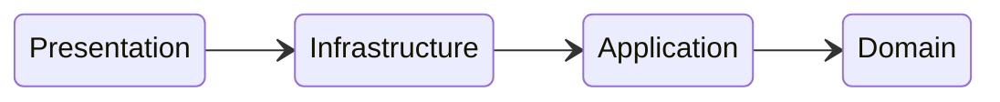

# typescript-clean-arch-template

## Usage

Usage template with yarn

```bash
  yarn install
```

## Environment Variables

You will need to add `.env` file based in `.env.example` file.

## Development

To deploy this project run

To run all development env

```bash
 yarn dev:app
```

To run app with watch

```bash
 yarn dev:app-watch
```

To run development infra with docker compose

```bash
 yarn dev:infra
```

To run type check

```bash
 yarn type-check
```

## Running Tests

To run tests

```bash
 yarn test
```

To run tests with watch

```bash
 yarn test:watch
```

To run tests with verbose

```bash
 yarn test:verbose
```

To run tests to staged context

```bash
 yarn test:staged
```

To run tests in ci

```bash
 yarn test:ci
```

## Build and transpiled code

```bash
 yarn build
```

To run transpiled code

```bash
 yarn start
```

## Application Arch Flow



## To do

- [x] Rename persistence repos to Stores
- [ ] Unit tests examples
  - [ ] Verify jest mock class to not be stuck of implementation and use interface
  - [ ] Stores
  - [ ] Entities
  - [ ] Usecases
- [x] Increment route models and abstractions to support Http Middlewares
  - [x] Add middlewares pre and post request
- [x] Increment route models and abstractions to support Route Groups
- [ ] Increment subscriptions models and abstractions
  - [ ] Add better configs to subscriptions to satisfy kafka features
- [ ] Add postgres
  - [ ] Make postgres adapter with pgPromise
  - [ ] Unit tests for Adapter
  - [ ] Add in stores
  - [ ] Add in docker compose dev infra
  - [ ] Add migration files support
- [x] Add better logs format
- [x] Add Http validation
  - [x] Unit tests
  - [x] Apply schema to routes and make adapter considerate schema
- [ ] Make Unit tests to express adapter
- [ ] Make unit tests to kafka adapter
- [ ] Add swagger
- [ ] Add Health routes
- [ ] Configure pre commit and pre push
- [ ] Create Docs
- [ ] Add observability example
  - [ ] New relic
  - [ ] Prometheus + Grafana
